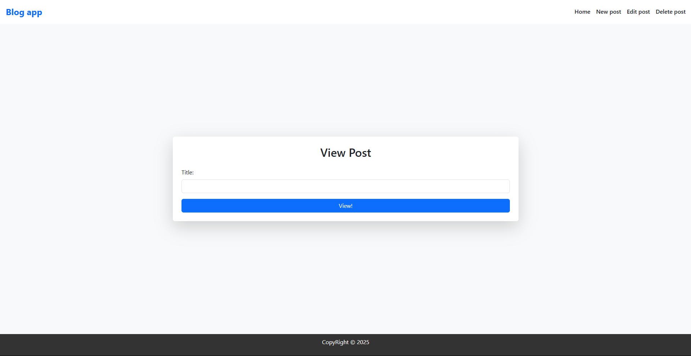
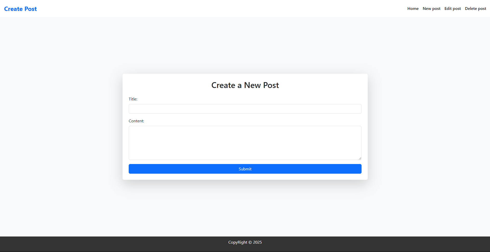
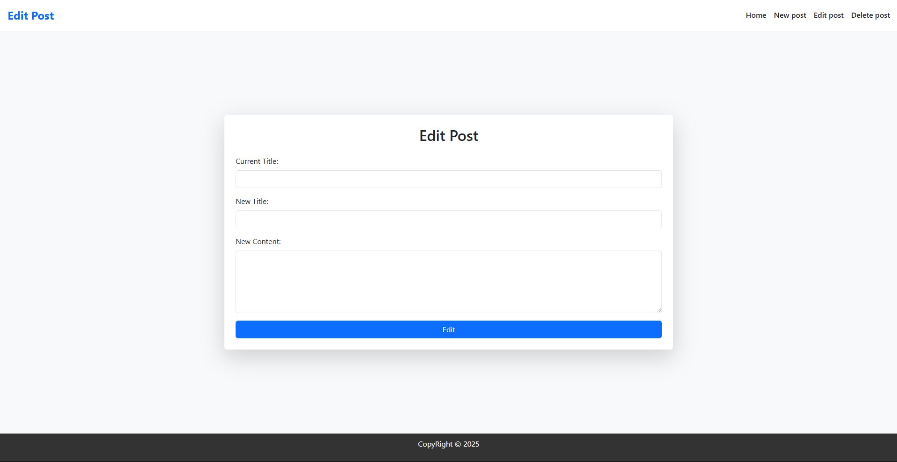
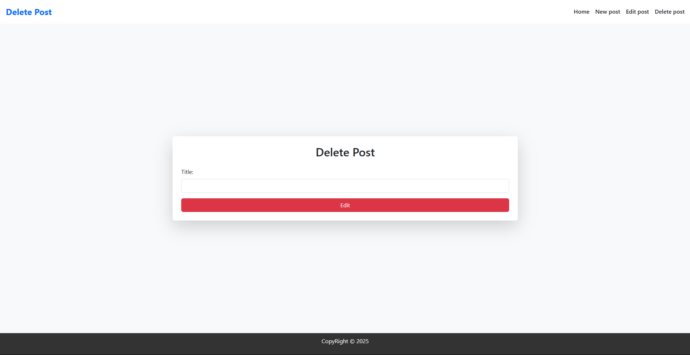

Blog App 📝
This is my VERY FIRST blog app project, I hope you like it 🙂

---

A simple web application for blogging that allows users to write, edit, and delete their blog posts. This project does not use a database; instead, it stores data in JSON.

🔹 Home Page

🔹 New Blog Page

🔹 Edit Blog Page

🔹 Delete Blog Page

🚀 Features
✅ Read existing blog posts
✅ Add new blog posts
✅ Edit blog posts
✅ Delete blog posts
✅ Frontend built with Bootstrap
✅ Data stored in JSON (no database)

🛠️ Technologies Used
- **Backend:** Node.js + Express.js  
- **Frontend:** Bootstrap (for styling)  
- **Storage:** JSON (temporary storage, no database)  
- **JavaScript:** Vanilla JS (DOM Manipulation)

---

📌 Future Improvements (TODOs)
🔹 Implement a real database like MongoDB or PostgreSQL
🔹 Add user authentication
🔹 Improve frontend UI with custom CSS
🔹 Add a search feature to filter blog posts

👨‍💻 Author
Developed by Ilya Revod
https://github.com/ilyaRevod

---

Blog App 📝
یک وب اپلیکیشن ساده برای بلاگ‌نویسی که به کاربر اجازه می‌ده بلاگ‌های جدید بنویسه، اون‌ها رو ویرایش کنه و حذف کنه. این پروژه بدون دیتابیس و با استفاده از JSON به عنوان ذخیره‌سازی پیاده‌سازی شده.

🔹 Home Page

🔹 New Blog Page

🔹 Edit Blog Page

🔹 Delete Blog Page

🚀 ویژگی‌ها
✅ خواندن بلاگ‌های ثبت‌شده
✅ اضافه کردن بلاگ جدید
✅ ویرایش بلاگ‌ها
✅ حذف بلاگ‌های نوشته‌شده
✅ فرانت‌اند طراحی شده با Bootstrap
✅ ذخیره اطلاعات در JSON (بدون دیتابیس)

🛠️ تکنولوژی‌های استفاده‌شده
- **Backend:** Node.js + Express.js  
- **Frontend:** Bootstrap (for styling)  
- **Storage:** JSON (temporary storage, no database)  
- **JavaScript:** Vanilla JS (DOM Manipulation)

---

📌 نکات آینده (TODOs)
🔹 اضافه کردن دیتابیس واقعی مثل MongoDB یا PostgreSQL
🔹 افزودن احراز هویت کاربران
🔹 بهبود طراحی فرانت‌اند با CSS سفارشی
🔹 افزودن قابلیت جستجو بین بلاگ‌ها

👨‍💻 نویسنده
Developed by Ilya Revod
https://github.com/ilyaRevod
